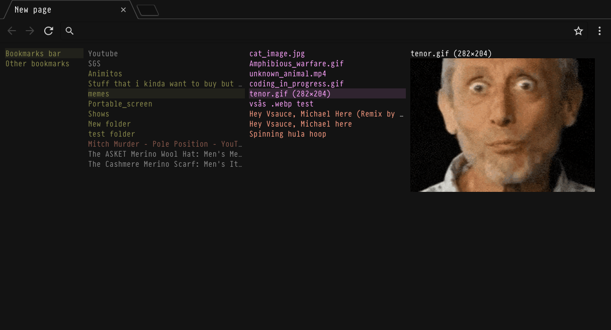
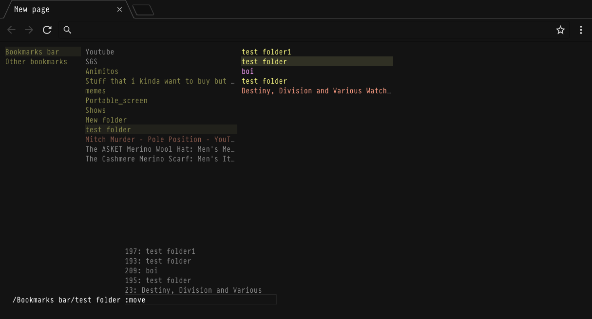
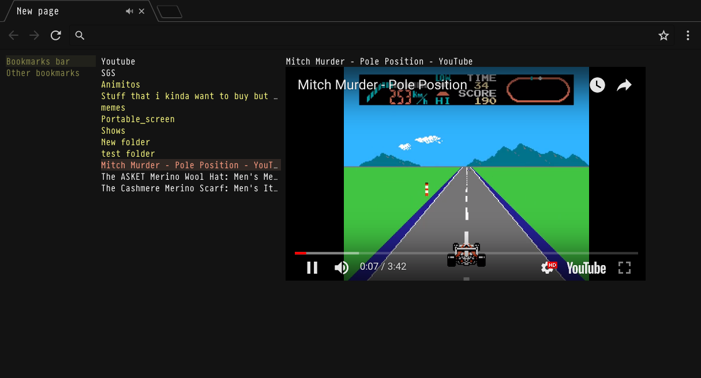

# Bookmark browser
Bookmark browser is a chrome extension that replaces the new tab page with a custom bookmark manager. This manager can browse through bookmarks similar to a file browser and also preform certain commands using a command window.

### Installation
To test the project out, open  [chrome extensions](chrome://extensions/) enable developer mode, click load unpacked extension and select the local folder containing the source code.

### Usage
#### Navigation
To navigate the bookmarks the arrow keys (`ijkl` also works) are preferred. Up and down selects different items within the current folder, and left and right moves the selection to the parent folder and the child folder respectively.

It is also possible to navigate with the mouse.

#### Command window
To open the command window press `:` or `.` (All commands starts with `:`) The command window is used to manage the bookmarks. It allows for deleting, moving, creating and modifying bookmarks.

All commands and their descriptions can be viewed using the `:help` command. When specifying a folder or bookmark, the ID should be used. The autocomplete feature might be helpful when doing this.

`Tab` will autocomplete the current command or argument while `Enter` will execute the whole command. Any output or information form a command will be presented in a separate window which can be closed be pressing `Esc`.

#### Previewing bookmarks
Bookmarks that can be previewed are shown in a distinct colour. The preview will be shown when the bookmark is selected. Special previews, like YouTube videos, will only show an partial preview and must be pressed or navigated left for the full preview.

### Customisation
Don't like stuff? Then change it. All colours are available as variable at the top the .css file, change them to suit your preference.
